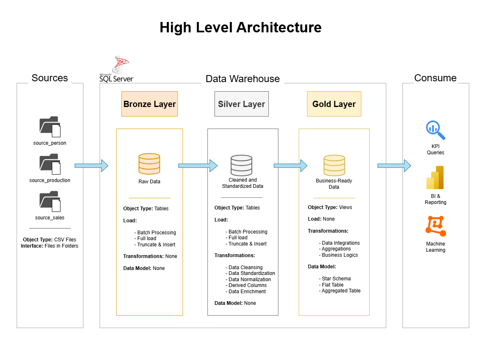

# SQL Data Warehouse Project



*Architecture of layered data warehouse after Medallion approach (Bronze, Silver, Gold)*

## Description

This project implements a structured, SQL Server–based data warehouse and analytics solution using a subset of the Microsoft AdventureWorks sample database as a realistic business data source.

The goal is to demonstrate end-to-end data engineering workflows including staging raw source data, applying cleansing and transformation logic, and building a star schema optimized for reporting and KPI-based analytics. The project follows a layered warehouse architecture inspired by the Medallion approach (Bronze, Silver, Gold).

---

## Objectives

- Build a structured Data Warehouse using SQL Server Express
- Ingest raw data into a reproducible staging layer (Bronze)
- Clean and standardize data into a curated integration layer (Silver)
- Model business-ready dimensional data into a star schema (Gold)
- Implement SQL-based KPI queries for business reporting and analysis
- Provide clear documentation and maintainable SQL scripts following naming conventions

---

## Project Structure

```
data-warehouse-project/
│
├── datasets/                           # Raw datasets used for the project 
│
├── docs/                               # Documentation, architecture and modeling
│   ├── data_architecture.pnd           # Bronze/Silver/Gold architecture diagram
│   ├── data_flow.png                   # ETL and data flow documentation
│   ├── data_models.png                 # Star schema / dimensional model
│   ├── data_catalog.md                 # Dataset catalog with column descriptions
│   ├── naming-conventions.md           # Naming rules for schemas, tables and columns
│
├── scripts/                            # SQL scripts for ETL and transformations
│   ├── bronze/                         # Scripts for extracting and loading raw data
│   ├── silver/                         # Scripts for cleaning and transforming data
│   ├── gold/                           # Scripts for creating analytical models
│   └── analytics/                      # KPI queries and reporting SQL
│
├── tests/                              # Data quality checks and validation scripts
│
├── README.md                           # Project overview and instructions
├── LICENSE                             # License information
├── requirements.txt                    # Dependencies and requirements for the project
└── .gitignore                          # Files and folders ignored by Git

```
---

## Methodology

This project follows a structured, engineering-oriented workflow similar to real-world Data Warehouse development.
The focus is on reproducibility, explicit schema design, and business-oriented analytical output.

### Data Architecture

The warehouse follows the Medallion Architecture pattern:

- Bronze Layer: Raw source ingestion (as-is)
- Silver Layer: Cleansed and standardized integrated data
- Gold Layer: Business-ready dimensional model optimized for analytics

This layered approach improves traceability and allows transformations to remain transparent and testable.

### Data Sources

The project is based on a curated subset of the official [Microsoft AdventureWorks sample database (AdventureWorks2022.bak)](https://learn.microsoft.com/en-us/sql/samples/adventureworks-install-configure?view=sql-server-ver17&tabs=ssms).
The subset was selected to represent a minimal but realistic sales and product domain for building a star schema.

Extracted source tables include:

- `Sales.SalesOrderHeader`
- `Sales.SalesOrderDetail`
- `Sales.Customer`
- `Person.Person`
- `Production.Product`
- `Production.ProductSubcategory`
- `Production.ProductCategory`
- `Sales.SalesTerritory`

These tables were exported individually as CSV files and serve as the raw input for the Bronze layer.


### Bronze Layer (Raw Ingestion)

The Bronze layer stores raw source data with minimal transformation.

Key principles:

- Preserve original source structure  
- Enable full traceability back to the raw input  
- Provide a stable base for downstream cleansing  


### Silver Layer (Cleansing and Standardization)

The Silver layer transforms Bronze data into a consistent and usable format.

Typical transformations include:

- Data Cleansing
- Data Standardization
- Data Normalization
- Derived Columns
- Data Enrichment 

This layer represents the first integrated and quality-controlled dataset.


#### Gold Layer (Dimensional Modeling)

The Gold layer contains the final business-ready dimensional model for analytics and reporting.

It is modeled as a star schema with a central sales fact table and supporting dimensions, including:

- `fact_sales` (sales transactions based on `Sales.SalesOrderHeader` + `Sales.SalesOrderDetail`)
- `dim_customer` (customer master data based on `Sales.Customer` + `Person.Person`)
- `dim_product` (product hierarchy based on `Production.Product`, `Production.ProductSubcategory`, `Production.ProductCategory`)
- `dim_territory` (sales region data based on `Sales.SalesTerritory`)
- `dim_date` (calendar dimension derived from `OrderDate`)

This schema is optimized for aggregation, KPI computation, and BI tools such as Power BI.

---

### Analytics Layer (SQL KPI Queries)

After the Gold layer is implemented, business-focused KPI queries are developed directly on top of the star schema.

Planned analytics include:

- Revenue and sales trends over time
- Order volume and average order value (AOV)
- Top customers and customer contribution to revenue
- Product performance by category and subcategory
- Territory-based sales performance and growth rates
- Seasonality analysis based on order date patterns

These KPI queries serve as the foundation for reporting and dashboarding.


---

## Tools & Technologies

- SQL Server Express  
- SQL Server Management Studio (SSMS)  
- T-SQL  
- Draw.io (architecture and data model diagrams)  

Optional extensions may include:

- Power BI (dashboarding)
- Python (automation, testing, ingestion scripting)
- Python (Supervised Machine Learning Analysis)

---

## Key Features

- Multi-layer Data Warehouse architecture (Bronze/Silver/Gold)
- Integration of multiple source systems 
- Cleansing and transformation logic implemented in SQL
- Star schema dimensional modeling for analytics
- Business KPI queries implemented in SQL
- Clean project structure and documentation

---

## Project Status

In progress. The project is developed incrementally with a clear phased approach. 

Current focus:

- Setting up the database environment, exploring the AdventureWorks source schema, and defining the first warehouse model.

Planned next steps:

- Bronze ingestion pipeline  
- Silver cleansing and standardization logic  
- Gold dimensional model implementation 
- Implement KPI queries in SQL (Analytics scripts)  
- Add documentation of key business metrics  
- Phase 2: Create a Power BI dashboard based on the Gold layer semantic model  

---

## Quickstart

1. Install required tools:
- SQL Server Express
- SQL Server Management Studio (SSMS)

2. Clone the repository:

```bash
git clone https://github.com/M-Kroll/sql-data-warehouse-project
cd sql-data-warehouse-project
```

3. Run SQL scripts in order:
- scripts/bronze/
- scripts/silver/
- scripts/gold/

4. Execute KPI queries:
- scripts/analytics/

---

## Acknowledgements

This project was inspired by the Data Warehouse tutorials from the YouTube channel "Data with Baara", which demonstrate a structured ETL workflow, Medallion architecture, and star schema modeling. 

All data, SQL scripts, and transformations in this repository were implemented independently using the AdventureWorks dataset.

---

## Author

Matthias Kroll

---

## License

Code is licensed under the MIT License. See LICENSE for details.
